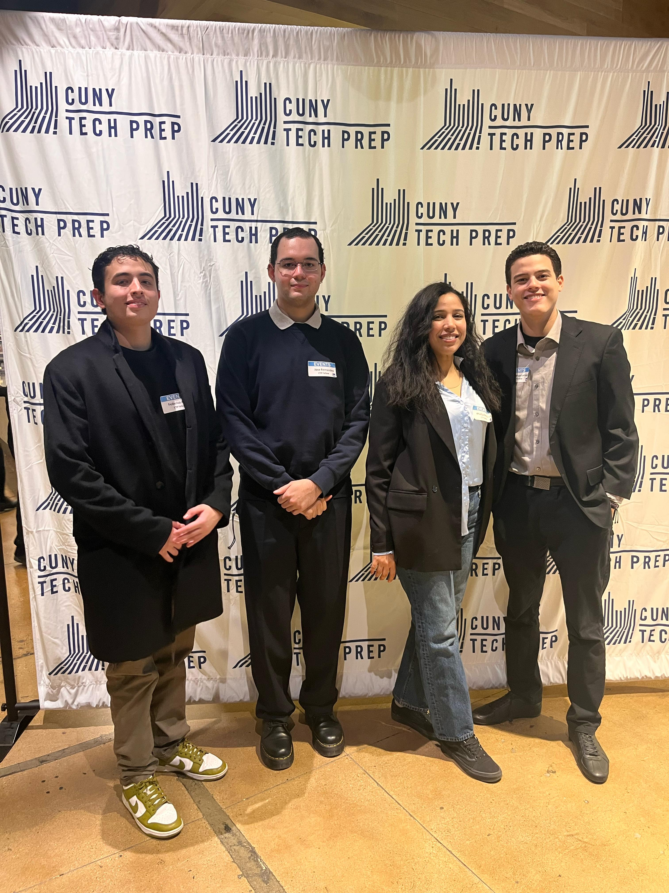

# 🗺️ Spoty

🚀Live:  https://spotymap.netlify.app/


## Overview

This project is an interactive map application that allows users to drop pins on locations they want to remember or share. Each pin can include tags, descriptions, and optional date/time details. Users can explore locations added by friends, filter pins by category, and view only the spots currently visible within their map view.

The goal is to create a social and personalized map experience — making it easy to discover events, places, and meaningful locations through a shared, interactive map.


## Demo Video

<p align="center">
  <a href="https://youtu.be/1c2sOuXYXR8" target="_blank">
    
  </a>
</p>

<p align="center">
  <em>Full project walkthrough and demo on YouTube(click image above).</em>
</p>


### MVP’s:

- Interactive map background
- Ability to drop pins on the map

### Features:

- View pins created by other users
- Distinct pin styles per user for easy recognition
- Assign categories/tags to pins for filtering
- Add descriptions, dates, and times to locations
- Filter visible pins based on the current map viewport

## Tech Stack

- **Frontend:** React (JSX), Tailwind CSS, JavaScript
- **Maps:** Leaflet
- **Backend/Database:** Supabase (PostgreSQL + Authentication)
- **Hosting:** Netlify --> https://spotymap.netlify.app/
- **Version Control:** Git & GitHub

## 📁 Project Structure

```txt
SPOTY/
├── .vite/                  # Vite build cache
├── frontend/               # Frontend entry (deployment-related)
│   └── index.html
├── public/                 # Public static assets
│   ├── images/
│   ├── pics/
│   └── _redirects          # Netlify routing config
├── src/                    # Main source code
│   ├── assets/             # App-specific images & assets
│   ├── components/         # Reusable React components
│   ├── styles/             # Global and component styles
│   ├── utils/              # Helper / utility functions
│   ├── App.jsx             # Root React component
│   └── main.jsx            # React entry point
├── .gitignore
├── eslint.config.js        # ESLint configuration
├── index.html              # Root HTML file
├── package.json            # Project dependencies & scripts
├── package-lock.json
├── README.md               # Project documentation
├── SUPABASE_SETUP.md       # Backend setup instructions
└── vite.config.js          # Vite configuration
```


## Supabase Authentication (local setup)

To enable authentication with Supabase, add the following environment variables to a `.env` file at the project root (Vite expects `VITE_` prefixes):

- `VITE_SUPABASE_URL` — your Supabase project URL
- `VITE_SUPABASE_ANON_KEY` — your Supabase anon/public key

Example `.env` (do not commit this file):

```
VITE_SUPABASE_URL=https://xyzcompany.supabase.co
VITE_SUPABASE_ANON_KEY=eyJhbGciOiJIUzI1NiIsInR5cCI6IkpXVCJ9...
```

Install new dependencies and run the dev server:

```powershell
npm install
npm run dev
```

Open `http://localhost:5173/` and you'll see a landing page with Sign In and Sign Up flows that use Supabase. After signing in or signing up, the app navigates to `/app` where the main map UI remains.

## Team

This project is developed as part of the **CUNY Tech Prep Fellowship (2025–2026 Cohort)** by a collaborative student team across multiple CUNY campuses.


<p align="center">
  
</p>

<p align="center">
  <em>The Spoty team presenting the project at CUNY Tech Prep Demo Night (LinkedIn NYC).</em>
</p>


## 📑(For CISC 4900 Requirement Only) (CTP team ignore this)

This section is for my **CISC 4900 Independent Project class**.  
It contains my timelog and is not part of the project deliverables for the team.


👉 [View My Timelog](https://docs.google.com/spreadsheets/d/1VS36THG6752LVym2R2I1hbBXIe4ayPEZ6rNSwWcLUPk/edit?usp=sharing)

👉 [View Project Slides](https://docs.google.com/presentation/d/1lrbwykHx-1x5xlfb3-FSU0PamzM-PCYd2D9Z4iFCPZI/edit?usp=sharing)
